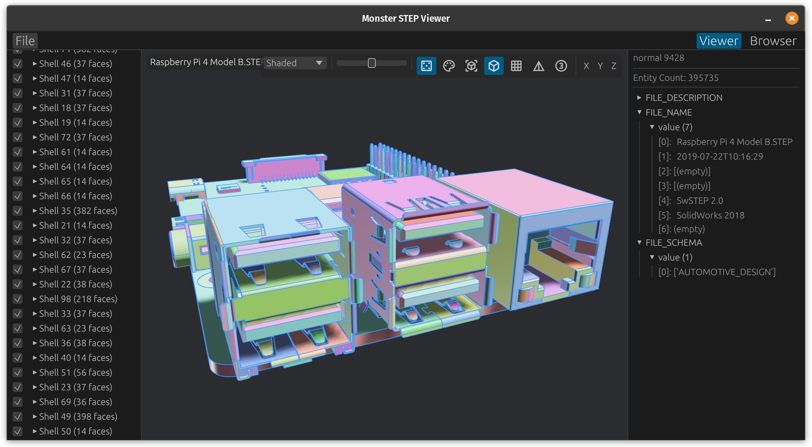

# `monster-step-viewer`

A 3D viewer for STEP (ISO 10303-21) CAD files, built with [`monstertruck`](https://github.com/virtualritz/monstertruck), `bevy` and `egui`. Optional path-traced overlay via [3Delight](https://www.3delight.com) (NSI).



## Features

- Load and display STEP files with full assembly support.
- Model hierarchy panel showing shells and faces.
- Per-face visibility toggling.
- Random colors mode for visualizing individual faces.
- STEP-defined colors from the file.
- Adjustable tessellation density.
- Wireframe edge display (boundary edges).
- Polygon-edge overlay (triangulated mesh edges) and isoparametric curve overlay.
- Per-axis clip planes (X/Y/Z, flippable, with optional solidify).
- Manual Y/Z up-axis toggle for files saved in either convention.
- Bounding box visualization.
- Pan/orbit camera controls with keyboard shortcuts.
- Optional 3Delight (NSI) path-traced overlay — see [3Delight Rendering](#3delight-rendering).
- File metadata display.

## Installation

```bash
cargo install monster-step-viewer
```

The installed binary is called `mstpv`.

## Usage

```bash
# Run with a STEP file
mstpv path/to/model.step

# Or run and use the file dialog
mstpv
```

## Controls

### Mouse

- **Right-drag**: Orbit.
- **Middle-drag**: Pan.
- **Scroll wheel**: Zoom (dolly).
- **Left-click**: Pick face/hierarchy item.

### Keyboard

- **R**: Reset view to the initial vantage.
- **F**: Frame the scene with the current camera angle.
- **C**: Center on the selected face.
- **Ctrl**+**+**/**-**/**0**: Zoom UI in/out/reset.
- **Esc**: Quit.

## Toolbar Icons

| Icon | Action |
| :--: | :----- |
| <picture><source media="(prefers-color-scheme: dark)" srcset="https://api.iconify.design/material-symbols/casino-outline.svg?color=white"></picture> | Random face colors |
| <picture><source media="(prefers-color-scheme: dark)" srcset="https://api.iconify.design/material-symbols/palette-outline.svg?color=white"></picture> | STEP-defined colors |
| <picture><source media="(prefers-color-scheme: dark)" srcset="https://api.iconify.design/material-symbols/view-in-ar-outline.svg?color=white"></picture> | Bounding box |
| <picture><source media="(prefers-color-scheme: dark)" srcset="https://api.iconify.design/material-symbols/deployed-code-outline.svg?color=white"></picture> | STEP curve wireframe |
| <picture><source media="(prefers-color-scheme: dark)" srcset="https://api.iconify.design/material-symbols/grid-on-outline.svg?color=white"></picture> | Isoparametric curves |
| <picture><source media="(prefers-color-scheme: dark)" srcset="https://api.iconify.design/material-symbols/details.svg?color=white"></picture> | Polygon (mesh) edges |
| `Z/Y` | Up-axis toggle -- current axis first; clicking swaps |
| <picture><source media="(prefers-color-scheme: dark)" srcset="https://api.iconify.design/material-symbols/counter-3-outline.svg?color=white"></picture> | 3Delight NSI overlay (requires `nsi-render`) |

Per-axis clip planes (X/Y/Z) cycle Off → +axis → −axis → Off. The toolbar also has a tessellation-quality slider and a shading-mode picker.

## [3Delight](https://www.3delight.com) Rendering

Build with the `nsi-render` Cargo feature for a 3Delight (NSI) progressive-render overlay:

```bash
cargo run --features nsi-render -- path/to/model.step
```

3Delight must be installed locally. `mstpv` looks it up at runtime — checking standard install paths and the `$DELIGHT` environment variable — and only enables the ③ toolbar button if it's found. Clicking it starts an interactive rendering session in 3Delight Display; camera moves translate in real time.

Native-only; wasm builds are unaffected.

## Building

Requires Rust 1.89+ (2024 edition).

```bash
cargo build              # debug
cargo build --release    # release
cargo build --release --features nsi-render
cargo test
```

### Linux Dependencies

```bash
# Debian/Ubuntu
sudo apt-get install libxcb-render0-dev libxcb-shape0-dev libxcb-xfixes0-dev libxkbcommon-dev libssl-dev libudev-dev

# Fedora
dnf install clang clang-devel clang-tools-extra libxkbcommon-devel pkg-config openssl-devel libxcb-devel systemd-devel
```

## Dependencies

- [`bevy`](https://bevyengine.org/) – game engine for rendering.
- [`egui`](https://github.com/emilk/egui/) – immediate-mode GUI.
- [`monstertruck`](https://github.com/virtualritz/monstertruck) – STEP parsing, BRep topology, tessellation.
- [`bevy_editor_cam`](https://github.com/aevyrie/bevy_editor_cam) – orbit/pan/dolly camera controls.
- [`meshopt`](https://github.com/gwihlidal/meshopt-rs) – mesh post-processing (vertex cache/fetch reordering); native-only.
- [`nsi`](https://github.com/virtualritz/nsi) – 3Delight scene interface bindings (`nsi-render` only).

## License

Licensed under either of Apache License, Version 2.0 or MIT license at your option.
